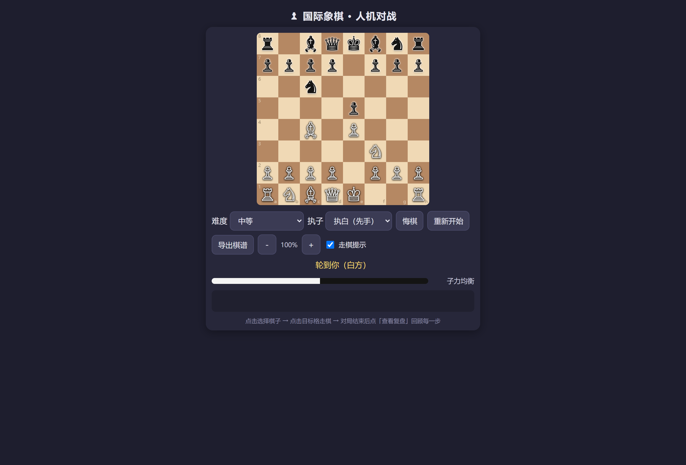

# ♟ 国际象棋 · 人机对战（离线版）

一个完全离线、无广告、单文件即可运行的国际象棋小游戏。适合已经懂规则、想轻松进阶又不想面对专业平台压力的玩家（多邻国式轻松向）。

## 特色功能

- **人机对战**：陪练 / 新手 / 简单 / 中等 / 困难 五档难度
- **💡 提示**：卡住时点一下，高亮当前局面的最佳走法（起点→终点）并给出记谱
- **一句话教练**：走完一步即时点评；走得太差会提示，送子会弹出「挂子预警」
- **小知识系统**：识别经典开局（意大利、西西里、西班牙、伦敦体系等 16 个），王车易位、吃过路兵、升变、将军等特殊时刻自动讲解
- **对局回顾**：评估曲线 + 每步好棋 / 稍差 / 失误 / 败着标注
- **复盘模式**：回放每一步、对比最佳走法（可摆出最佳走法）
- **课后小课堂**：局末自动总结本局表现，按你的问题推荐 1–3 个学习主题
- **棋谱导出**：SAN 棋谱 + 最终 FEN，方便复盘和分享
- **全中文记谱解释**：复盘时每步都有中文翻译，附「棋谱符号怎么看」说明

## 使用方式

1. 直接打开 `国际象棋-人机对战-离线版.html`（推荐 Chrome / Edge / 安卓浏览器）
2. 手机端：下载 `国际象棋-人机对战-离线版.zip`，解压后用浏览器打开 HTML 即可
3. 详细说明（含打包成 APK 的方法）见 [使用说明.md](使用说明.md)

## 技术说明

- 纯 HTML + JavaScript 单文件实现，**无需联网、无需安装、无广告、无账号**
- 自研国际象棋引擎（含合法走法生成、将军/将杀/逼和/升变/吃过路兵/王车易位，perft 1/2/3 = 20/400/8902 已验证）
- 数据本地存储（缩放设置等），棋谱可复制导出

## 相关文档

- [市场调研报告](国际象棋App市场调研与功能建议.md)：主流国际象棋 App 功能对比与产品定位分析
- [使用说明](使用说明.md)
